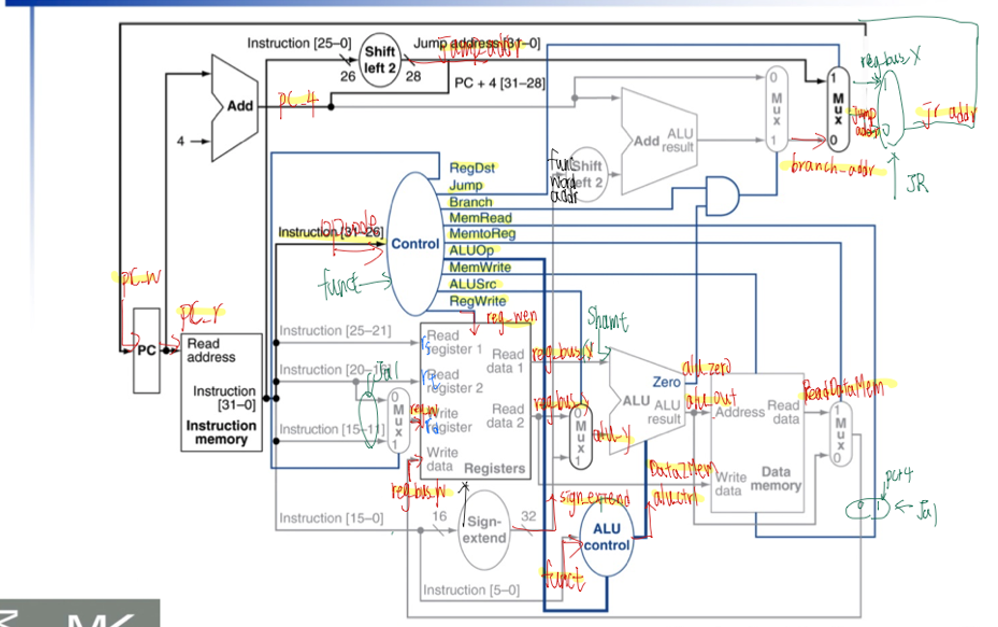

# Single Cycle MIPS CPU Implementation

    

## Introduction

Microprocessor without Interlocked Pipeline Stages (MIPS) is a widely used instruction set architecture. In this exercise, we’re going to implement the single-cycle MIPS architecture using **Verilog**

## Implementation

We reference the block diagram in textbook, and add more wires and blocks on it to ensure it can meet the requirement.

    

Moreover, to support the floating point calculation, we design our on Control table and ALU table.

Control Table

    

ALU Table

   

### How we support FPU
1. Extend the control unit. We add OpDouble to determine whether the instruction is double instruction, add RegWrite to determine which write mode it is (R/I/FR/I(FP)), add RegReadType to determine whether we should read fs/ft/fd or rs/rt/rd, and add FPCond to determine whether we need to access FP Cond.

2. Use the remaining 4 bits of ALU control to support Single +-*/ and Double +-. 

3. Extend reg output, ALU input, and ALU output to 64 bit. Fill 0 to unused 32bit.

4. When in double lw/sw, because we need to read 64 bits, we should split it into 2 cycles. Therefore, we need to stop PC once.

5. In ALU unit, we need to use the given library. Therefore, we should instantiate first, and then give them parameters.

## Performance

- cycle time: 14.0
- FPU Single: Y
- FPU Double: Y

## Author

- [ByronHsu](https://github.com/ByronHsu)
- [JoeyYang](https://github.com/joeyy5588)